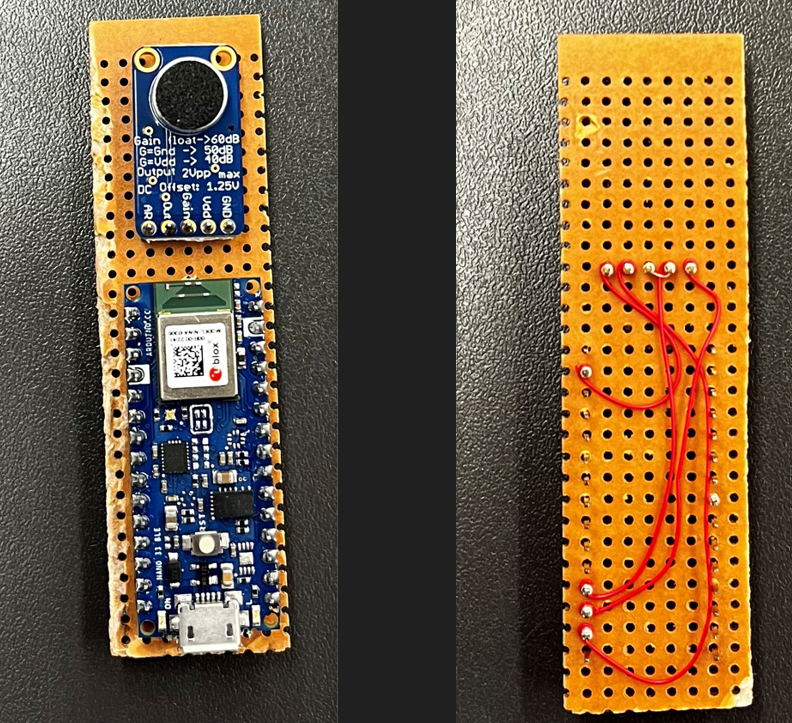
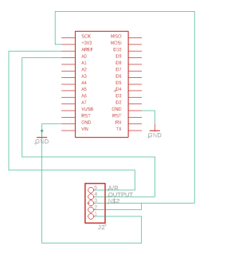
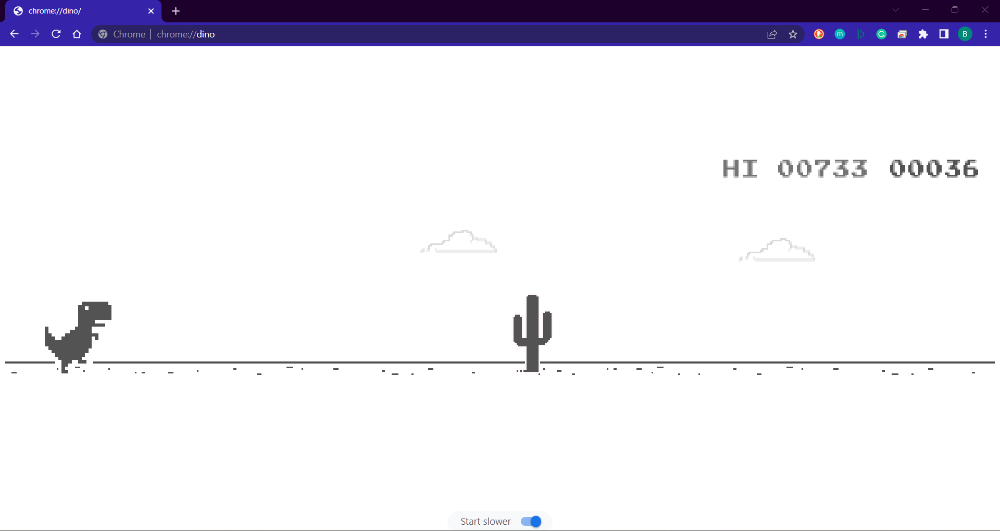

# SPeech Recognition on embeDded systems (SPRD)

SPRD is a senior design project for the University of Kentucky College
of Engineering whose primary goal is to achieve speech recognition on
cost-effective, low-resource embedded devices via machine learning. The project
demonstrates such complex topics via a fun and interactive game. This repository
houses all the code used to develop the device.

## Repository Structure

The repository is divided into four primary folders: `audio_recorder`,
`experimental`, `micro_speech`, and `model_training`.

`audio_recorder` contains instructions and code to record audio from
the SPRD device. This is useful to test if the microphone is working and
allows you to add data from the device you're using to the training set. This
should \~hopefully\~ improve the performance of your device.

`experimental` contains test and proof-of-concept code that is not
used in the SPRD device at all. You can largely ignore this folder. It
was simply used for testing ideas during development.

`micro_speech` contains the speech recognition application that runs on the SPRD
device.

`model_training` contains the necessary tools and instructions to
train a machine learning model for speech recognition. It uses Docker, a
containerization tool that enables you to train models on any major operating
system. You can use this to experiment with different model architectures and
other training parameters.

### NOTE
The `audio_recorder` and `model_training` folders contain detailed
documentation on how to use the tools they contain. `micro_speech` is
explained in detail in this document.

## Device Hardware Specification

The SPRD device is quite simple. It is composed of 2 pieces of
hardware: a microcontroller and a microphone. Below are images of a
prototype.

### Microcontroller

The SPRD device uses an [Arduino Nano 33 BLE](https://store-usa.arduino.cc/products/arduino-nano-33-ble-with-headers?selectedStore=us)
as its microcontroller. There are two versions of this device: one
with headers and one without. The link we have provided here is for
the device without headers. It is up to you which one you choose, but
if you choose the one without headers, you'll have to solder them on
yourself. We chose this device because it is officially supported by
Tensorflow via their Tensorflow Lite for Microcontrollers
[(TFLM)](https://www.tensorflow.org/lite/microcontrollers) library, it
is relatively cheap, and there is a lot of online support for it since
Arduino devices are intended for education. You can find documentation
for this device [here](https://docs.arduino.cc/hardware/nano-33-ble).

### Microphone

The only other piece of hardware on for the SPRD device is an
[Adafruit Electret Microphone Amplifier Module](https://www.adafruit.com/product/1713)
. In the event that the given link breaks, the module is called:
"Adafruit Electret Microphone Amplifier - MAX9814 with Auto Gain Control
\[ADA1713\]".

### Connecting the Microphone to the Microcontroller

It is simplest to start with using a breadboard and jumper wires to
connect the Arduino to the microphone module.

#### Wiring Schematic

#### Wiring Instructions

1. Connect the "Out" pin of the microphone to analog pin A0 on the
Arduino.
2. Connect the "Vdd" pin of the microphone to the +3.3V pin on the
Arduino.
3. Connect the "AR" pin of the microphone to the "AREF" pin of the
Arduino.
4. Connect the "GND" pin of the microphone to the "GND" pin of the
Arduino.
5. (Optional but recommended) To have a 40dB gain configuration on the
microphone, short the "Gain" and "Vdd" pins of the microphone together.

## Speech Recognition Application

The speech recognition application supports a voice-controlled interface
to simple games that require the user to press the space bar and down arrow keys
on their keyboard. The application is designed to recognize when the user says
the words "up" or "down" into the microphone. If "up" is heard, the LED on the
device lights up green and a space bar is sent to the computer the device is
connected to via USB. If "down" is heard, the LED lights up red and a down arrow
key is sent to the connected computer. If any other speech is heard, the LED
lights up blue and nothing is sent to the computer.

The idea for this application was to allow users to play the Google
Chrome Dino Run game with their voice. Unfortunately, due to
limitations in the hardware and software, the latency and accuracy of
the device makes this quite difficult. Future work would be to try to
optimize the application to reduce latency and/or improve accuracy.

### Usage Instructions

We recommend you use the [Arduino IDE](https://www.arduino.cc/en/software) to
build and upload the speech recognition application to the SPRD device. Once you
have done so, you will be ready to play the Chrome Dino game! Simply plug the
SPRD device into a USB type-A port of your computer and pull up the game. It
should work with no other set up needed. To get the best accuracy, we recommend
holding the device ~1 inch from your mouth, and clearly enunciating the "p" in
"up" and the "n" in "down".

### `micro_speech` Arduino Sketch

The `micro_speech` folder contains an Arduino sketch provided by Google that has
been altered for the specific needs of our project. You can find the unaltered
version [here](https://github.com/tensorflow/tflite-micro-arduino-examples/tree/main/examples/micro_speech).
This sketch depends on the TFLM library. Instructions on how to install this
library can be found [here](https://github.com/tensorflow/tflite-micro-arduino-examples).
We will now present the portions of the code we altered and why.

#### Audio Provider

We altered the portions of the sketch that read in audio from a microphone and
store it in a buffer to be preprocessed and analyzed for speech by the ML model.
This was necessary because the original sketch was intended for the Arduino Nano
33 BLE Sense, a slightly more expensive microcontroller that has an onboard
microphone. The Arduino we are using does not.

Since we are connecting our own microphone to the Arduino, we need to implement
custom drivers for sampling audio from this mic. This involves connecting the
output pin of the microphone to an analog input pin on the Arduino and using the
Arduino's analog to digital converter (ADC) to store the audio data in program
memory. This must be done at a regular interval. The model expects this interval
to be 16kHz. Arduino has an extremely simple API for reading values from analog
pins using the ADC. Unfortunately, this API has a lot of overhead, and does not
come close to achieving the 16kHz sampling rate we need, epecially when the
microcontroller is running an ML algorithm simultaneously. We need a method with
much less overhead, something that is "closer to the metal", to achieve this.

After searching online, we came across [this Arduino blog post](https://forum.arduino.cc/t/increase-the-adc-sample-rate/701813?u=xing_2019)
that provides a framework we can use to achieve our 16kHz goal. Many thanks to
the user `Klaus_K` for their contribution. This approach uses the dedicated
timer and ADC circuitry on the microprocessor that is on our Arduino model. It
initializes the ADC to run in "free-run mode" asynchronously from the CPU. This
means the ADC is sampling continuously (according to the documentation: at
approximately a 200kHz rate), while the CPU is free to run the ML algorithm.
Then, we initialize a timer circuit that triggers an interrupt in the CPU at a
regular interval: 16kHz. This circuit also runs asynchronously from the CPU.
Every time the CPU receives this interrupt, it executes a function called a
callback that copies the most recent value from the ADC into the audio buffer.

The approach described above is ideal because very little work is needed by the
CPU. It is free to perform all the computations needed for the ML algorithm, and
lets the timer/ADC circuits do all the dirty work.

#### ML Model

The second portion of the original sketch we altered is the ML model used to
analyze speech. We followed the process described in the documentation of the
`model_training` folder to train a custom model to recognize the words "up" and
"down". We replaced the model in the original sketch with this one.

#### Command Responder

The final portion of the original sketch we altered was how the device responds
when a keyword is detected. We used Arduino's built-in Human Interface Device
(HID) library that allows the device to emulate a keyboard. This is what allows
us to send spacebar and down-arrow keys to the computer the device is connected
to. From the perspective of the computer, the SPRD device is a keyboard
connected via USB.

### Useful Links to Understand Speech Recognition via tinyML

- [TensorFlow Tutorial on Training a Simple Speech Recognition Model](https://www.tensorflow.org/tutorials/audio/simple_audio)
- [Google Colab Demo for Speech Recognition on SparkFun Edge](https://codelabs.developers.google.com/codelabs/sparkfun-tensorflow#0)

- [TensorFlow Code Used to Train Our Model](https://github.com/tensorflow/tflite-micro/tree/main/tensorflow/lite/micro/examples/micro_speech/train)

- [Netron Model Visualization Tool](https://netron.app/)

## Attributions

SPRD is a senior design project by Ben Richey, Isabella Bowling, Oluwatofunmi
Oyetan, and Trey Boggess. The project was sponsored by Dr. Sayed Ahmad
Salehi and Dr. Michael T. Johnson. Thanks to our sponsors for their
guidance and funding. Also, thanks to Dr. Regina Hannemann, Dr. Samson
Cheung, Dr. Robert Adams, Seun Alo, Cole Cuddy, and Daniel Muchow for
your guidance and support.