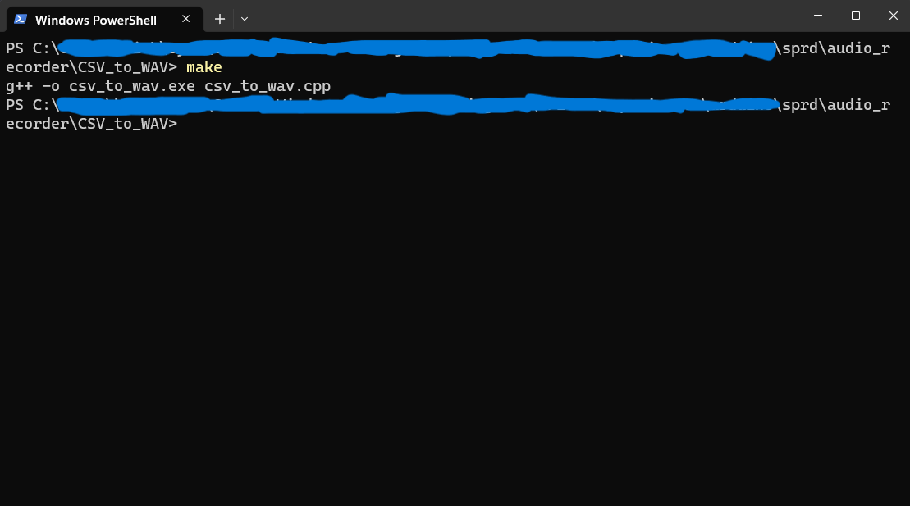

# How to record and store audio in .wav format from Arduino
### by Ben Richey

This tutorial will walk you through recording audio from your SPRD device and
storing it as a waveform file (.wav format) on your computer. This is useful for
debugging, profiling, and recording data to add to the training set in an effort
to improve the performance of the SPRD device. This method is not the best. I
would've liked to have made it more automated, but this is all I had time for
and it gets the job done.

## audio_recorder.ino

The `audio_recorder.ino` file is an Arduino sketch that enables you to record
audio from the SPRD device and print the raw audio data to a serial connection.
You should be able to compile and upload this sketch directly to the SPRD
device using the Arduino IDE. Once this is done, it will print a prompt on the
serial terminal asking the user if they'd like to record a 5 second audio clip.
If the user enters a 'y' into the serial terminal, the device will begin
recording. Once the recording is complete, it will begin printing the raw data,
where each value is separated by commas. This will take some time because the
program is printing 5 seconds worth of 16kHz audio data (80,000 values) over a
serial connection with a 9600 baud rate. You'll know that all 80,000 values have
been printed once the prompt to record more data is printed.

## Storing raw data on your PC

Once all 80,000 values have been printed to the serial connection mentioned
above, copy them to your PC's clipboard. Then, create a file with the `.csv`
extension and copy the 80,000 values into the file. Save that file with a
descriptive name. Examples of what these files should look like are in the
`audio_recorder/CSV_to_WAV/sample_csv` folder.

## Recording and storing audio in CSV format Demo
Please note: Parts of this video were sped up for brevity.

https://youtu.be/1VqSZVKbeEY

## Converting CSV to .wav

You can convert the raw data stored in the CSV file you created above using the
`csv_to_wav` program that you can compile in the `audio_recorder/CSV_to_WAV`
folder. Feel free to view the source code to see how it works.

### Building the csv_to_wav program

There is a simple `Makefile` in that folder that allows you to build the program
with a single `make` command. You just need to have `Make` and `g++`, the GNU
C++ compiler, installed on your PC. If you don't, a quick Google search should
yield easy to follow instructions to install those tools on whatever OS you're
using. Assuming you have those tools installed, you can open a terminal in the
`audio_recorder/CSV_to_WAV` folder and type the following command:
```
make
```
This should compile the program `csv_to_wav.exe` in the
`audio_recorder/CSV_to_WAV` folder. Example output is shown below:



### Using the csv_to_wav program

It's quite simple to use the csv_to_wav program to convert raw audio data in
CSV format into waveform format. Open a terminal in the
`audio_recorder/CSV_to_WAV` (or use the one you already opened, assuming it's
still open). Type the following command:
```
./csv_to_wav.exe
```
You will be prompted to enter the path and filename to the CSV file containing
the raw audio data. Do that and hit `Enter`. You will then be prompted to enter
the path and filename of where you would like to store the waveform file. Do
that and hit `Enter`. Assuming you entered the file names in correctly, and
they are the correct format, you should have a proper waveform file in the
location you specified. This program does minimal error checking, so if you
performed any of the above steps incorrectly, incorrect results will be
produced.

### Compilation and Usage Demonstration

https://youtu.be/DFpCMg7WAwo

