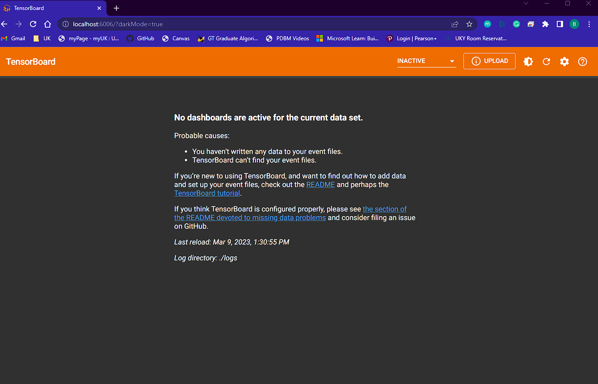
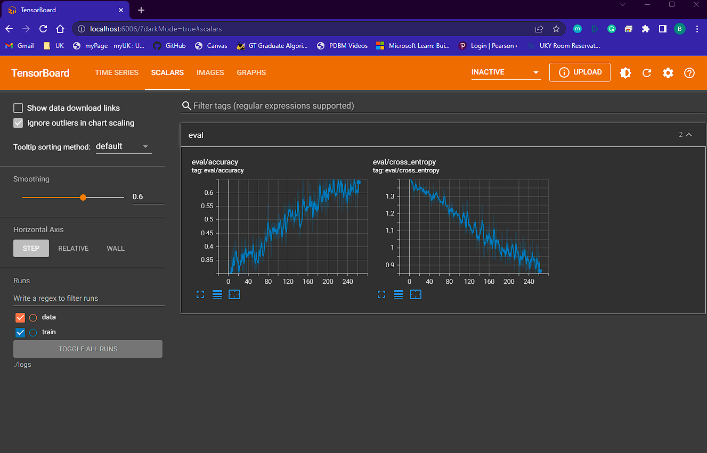

# Training SPRD Speech Recognition Model w/ Docker
### by Ben Richey

In this tutorial, you'll learn how to build a custom Docker image that is
prepared to train the speech recognition model used in the SPRD device. In
addition, you'll learn how to use a container based on the image to train
a model, monitor the training process using a Tensorboard on your computer's
browser, export the model to your computer, and alter the training parameters.

## Installing Docker

Docker is an open source platform that allows you to build, run, deploy, and
ship applications. It works on every major OS, and I chose to use it to
ensure that all users have the same experience training the model regardless of
which platform they are on. You can learn more and install Docker [here](https://docs.docker.com/get-docker/)

## Building the Docker Image

Assuming you have Docker installed on your machine and it is running, you can
build the image by opening a terminal in the `model_training` directory and
running the following command:

```
docker build -t model_trainer .
```

This should work on Windows, Mac, and Linux. Assuming it completes successfully,
you should see this image available in your Docker engine.

## Training the Model

The `train_model.sh` script contains the command and parameters used to train
the model. If you'd like to play with different parameter configurations, feel
free to alter the parameters at the top of the script.

To train the model, you'll need to create a new docker container based on the
image built in the steps above with the following command:

```
docker run -it -p 6006:6006 model_trainer
```

This will create a container and allow you to interact with it in the terminal
you ran that command in.

First, we will start up Tensorboard, which is a utility by TensorFlow that
allows you to monitor the training process. You can do that with the following
commands in the terminal you just created to the running docker container:

```
cd
tensorboard --logdir ./logs --bind_all
```

This will allow you to monitor the training process through your web browser.
Go ahead and open your web browser and type `localhost:6006` into the address
bar. You should see a Tensorboard webpage that has some message about no data
available yet. It should look like this:



Now, you're ready to start training. You'll need to open a new terminal and
connect to your running docker container. You can find the name of your running
docker container you just created with the following command:

```
docker container ls
```

This command will list all of your docker containers on your system. If there's
more than one, it's up to you to figure out which one is the one you just
created. Some context clues are if it's actively running, how long it's been
running, and the image it was made from. You can connect a new terminal to the
running container using the following command, where you replace
"conatiner_name" with the name of your container you found in the above command:

```
docker exec -it container_name bash
```

Now, using the terminal you just opened, you can start trainig with the
following commands:

```
cd
./train_model.sh
```

The training process should begin in that terminal. This will likely take a
while, particularly because the computation is being done by the processor, so
depending on how many cores you have on your CPU and how much RAM you have,
it'll likely take over an hour.

After the training set has downloaded, training will begin, and you can monitor
it by refreshing the Tensorboard on your browser. In the Tensorboard web page,
hit refresh, and then click the "Scalars" tab to view graphs of the accuracy and
loss. It should look something like this:



## Saving the model

Once the training is complete, you can save the model to .tflite and C byte
array formats using the following command in the terminal where you executed
the train command:

```
./save_model.sh
```

The C byte array format of the trained model will be stored in `/root/model.cc`
of the docker container. The quantized and floating point versions of the
.tflite format will be stored in the `/root/models/` directory of the docker
container. If you'd like to use these trained model files, you can copy a file
`filename` located in path `file_path` from the docker container
`container_name` to the location `path` on your host machine using the following
command:

```
docker cp container_name:file_path/filename path
```

## Altering training parameters

You can alter training parameters such as the number of epochs, learning rate,
words to be trained on, and more by opening the `train_model.sh` script and
changing the parameter values at the top of the script. Once you've done this,
be sure to save the changes and rebuild the docker image before beginning a new
training session for your alterations to take effect. Certain parameters are
common to the `train_model.sh`, `save_model.sh`, and `tf_to_tflite.py`
programs, so if you make changes, be sure to update all three.
